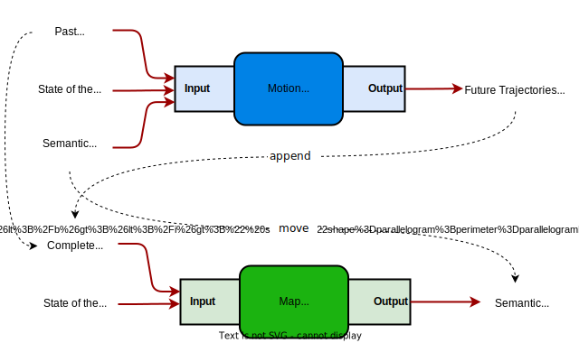
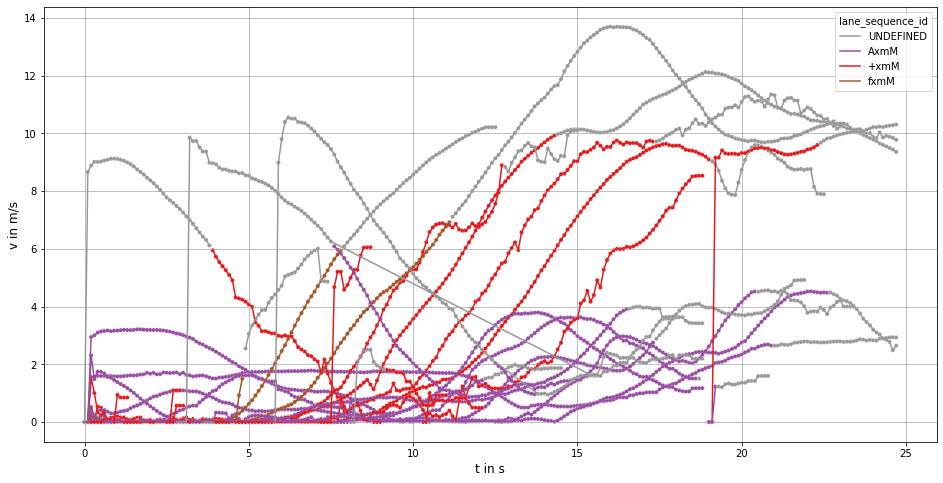
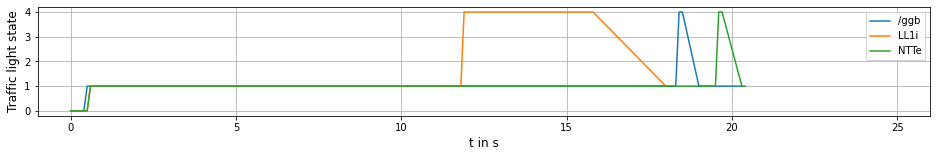
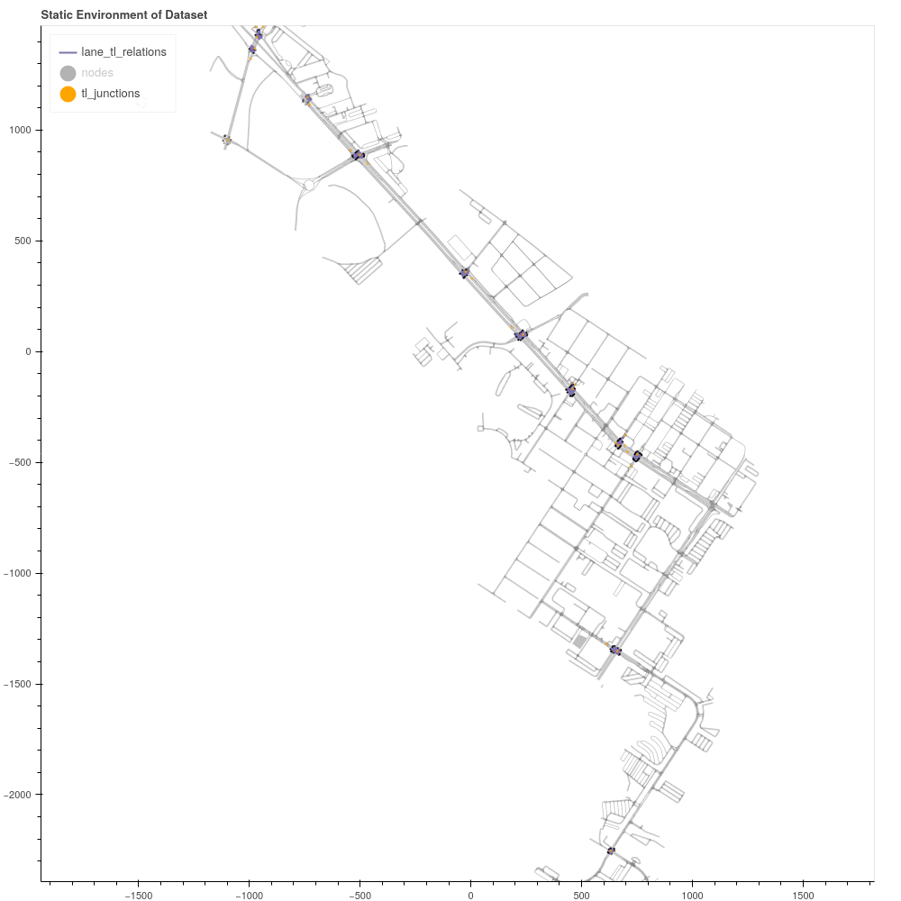
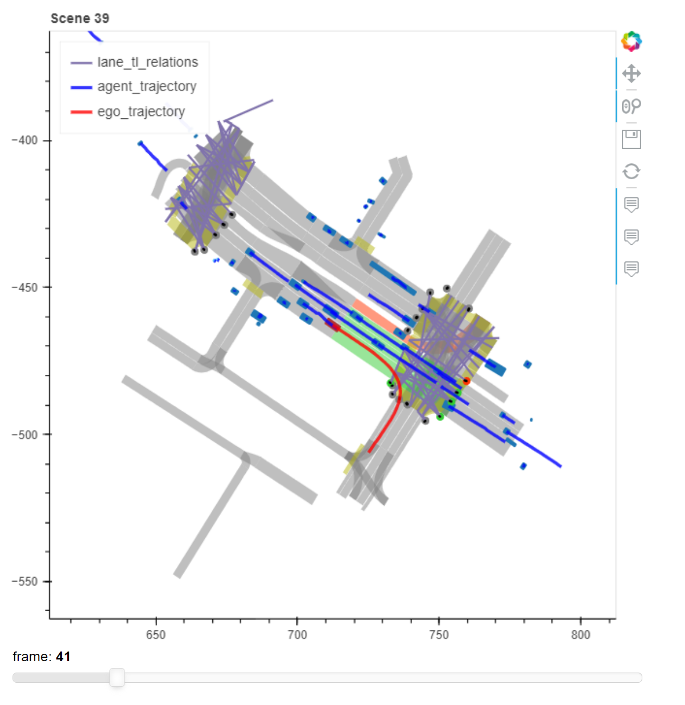

<div align="center">
<h1>Semantic Map Learning of Traffic Light to Lane Assignment based on Motion Data </h1>

<p>This repository houses the source code of the paper: <i>Semantic Map Learning of Traffic Light to Lane Assignment based on Motion Data.</i> </p>


  <p>
    <table >
      <tr>
          <td><a href="https://orcid.org/0000-0002-8318-5594">Thomas Monninger </a></td>
          <td><a href="https://orcid.org/0009-0004-1672-430X">Andreas Weber    </a></td>
          <td><a href="https://orcid.org/0000-0002-0780-4154">Steffen Staab    </a></td>
      </tr>
    </table>
  </p>
</div>

## Abstract
Understanding which traffic light controls which lane is crucial to navigate intersections safely.
Autonomous vehicles commonly rely on High Definition (HD) maps that contain information about the assignment of traffic lights to lanes.
The manual provisioning of this information is tedious, expensive, and not scalable.
To remedy these issues, our novel approach derives the assignments from traffic light states and the corresponding motion patterns of vehicle traffic.
This works in an automated way and independently of the geometric arrangement.
We show the effectiveness of basic statistical approaches for this task by implementing and evaluating a pattern-based contribution method.
In addition, our novel rejection method includes accompanying safety considerations by leveraging statistical hypothesis testing.
Finally, we propose a dataset transformation to re-purpose available motion prediction datasets for semantic map learning.
Our publicly available API for the Lyft Level 5 dataset enables researchers to develop and evaluate their own approaches.


## Table of Content
- [Table of Content](#table-of-content)
- [💿 Setup](#-setup)
- [🚘 Approach](#-approach)
- [📁 Dataset](#-dataset)
  - [⚙️ Preprocessing](#️-preprocessing)
    - [Traffic Light Scenes](#traffic-light-scenes)
    - [Agent to Lane Mapping](#agent-to-lane-mapping)
    - [Agent Motion](#agent-motion)
    - [Traffic Light State Mapping](#traffic-light-state-mapping)
    - [Junction, Branch and Lane Dataset](#junction-branch-and-lane-dataset)
    - [Combined Features](#combined-features)
    - [Ground Truth (TL2LA)](#ground-truth-tl2la)
  - [👀 Visualisation](#-visualisation)
    - [Agent Motion](#agent-motion-1)
    - [Traffic Light State](#traffic-light-state)
    - [Semantic Map](#semantic-map)
    - [Interactive Scene Visualization](#interactive-scene-visualization)
  - [📃 Results](#-results)
- [📜 License](#-license)
- [🔗 Citation](#-citation)
- [📰 News](#-news)

## 💿 Setup
1. Install dependencies of this project, which also includes the [Lyft Lvl5 dev-kit](https://github.com/woven-planet/l5kit) into a new virtual environment using the requirements.txt

```
python -m venv <venv_name> 
pip install -r requirement.txt
```
2. Download the [*Lyft Lvl5 Motion Prediction Dataset*](https://woven.toyota/en/prediction-dataset)
3. Place dynamic datasets into Folder dataset/complete/
4. Set Python path to *lyft_l5_tl2la/*
```
#powershell
$env:PYTHONPATH=".lyft_l5_tl2la/"

# vscode (settings.json)
 "jupyter.notebookFileRoot": "${workspaceFolder}/lyft_l5_tl2la/",
```

5. Explore the data with the visualization tools and the interactive Python Notebooks


## 🚘 Approach

<div align="left">   </div>

To derive the traffic light to lane association (TL2LA), it requires **dynamic information** and **static information**.


- **Dynamic information**:
  - Agents' behavior in the form of trajectories. These represent the positional information of agents over time.
  - Time-dependent traffic light state
- **Static information**:
  - Lane model (provided by semantic map). Contains geometric information of lanes and their connectivity

The output of the TL2LA system is the association of traffic lights and lanes (semantic relation). They also represent a static information and can be stored into a high-definition (HD) map.


## 📁 Dataset

General information and references to the original Lyft Lvl 5 Motion Prediction Dataset:
- [Documentation](https://woven-planet.github.io/l5kit/)
- [Repository](https://github.com/woven-planet/l5kit)
- [Paper](https://arxiv.org/abs/1805.04687)
- [License](https://woven-planet.github.io/l5kit/license.html#license)

Download all dataset files of the [*Lyft Lvl 5 Motion Prediction Dataset*](https://woven.toyota/en/prediction-dataset) and organize them in the following structure under the *dataset/* directory:

  ```
  dataset/
  ├──── aerial_map/
  │     ├──── nearmap_images/
  │     └──── aerial_map.png
  ├──── complete/
  │     ├──── sample/
  │     ├──── train/
  │     └──── train_full/
  └──── semantic_map/
        ├──── meta.json
        └──── semantic_map.pb
  ```

### ⚙️ Preprocessing

Preprocessign the dataset can be done with the notebook: [preprocess_dataset.ipynb](lyft_l5_tl2la/scripts/preprocessing/preprocess_dataset.ipynb)

#### Traffic Light Scenes
- These datasets contain the indices of scenes that show traffic lights
- Can be generated for each dataset type (train1 or trainfull dataset) tls_scene_indices_train1.pkl, tls_scene_indices_trainfull.pkl

#### Agent to Lane Mapping
- 138,000 Scenes in total (trainfull dataset)
- Split into 1000 pickle files
- Maps agents to lane segments of the Lyft Level 5 semantic map

> Structure of Agent to lane Mapping Dataset
> | scene_idx | frame_idx | agent_id | lane_ids |
> | --------: | --------: | -------: | :------- |
> |         1 |         0 |        0 | [pcct] |
> |         1 |         0 |        1 | [pcct] |
> |       ... |       ... |      ... | ...      |

#### Agent Motion
- Adds vehicle kinematics to Agent to Lane Mapping Dataset
- Split into 1000 pickle files

> Structure of Agent Motion Dataset
>|      | scene_idx | frame_idx | agent_id | lane_id | junction_id | branch_id | lane_sequence_id | sequence_head_lane_id | time |       v |        a | centroid                        |
>| ---: | --------: | --------: | -------: | :------ | :---------- | :-------- | ---------------: | :-------------------- | ---: | ------: | -------: | :------------------------------ |
>|    0 |         1 |       161 |        0 | 6AUT    | y4Ss        | Evy5c     |              110 | +xmM                  | 16.1 | 9.53438 | -1.06195 | [  738.14093018 -1399.18835449] |
>|    1 |         1 |       162 |        0 | 6AUT    | y4Ss        | Evy5c     |              110 | +xmM                  | 16.2 | 9.58854 | 0.541639 | [  737.33410645 -1398.67028809] |
>|  ... |       ... |       ... |      ... | ...     | ...         | ...       |              ... | ...                   |  ... |     ... |      ... | ...                             |


#### Traffic Light State Mapping
- Based on the detected state of the traffic light bulbs, the traffic light state is derived. 
- Traffic Light State are mapped to the following signals Red: 0, Green: 1, Yellow: 2, Yellow-Red: 3, Unknown: 4

> Structure of Traffic Light Mapping Dataset
>| scene_idx | frame_idx | tl_id | tl_status | active_faces | inactive_faces | unknown_faces    |
>| --------: | --------: | :---- | --------: | :----------- | :------------- | :--------------- |
>|         1 |        95 | /ggb  |         4 | []           | []             | [CDDo jutE xbVG] |
>|         1 |        95 | NTTe  |         0 | [/NIJ]       | []             | [Q11q, xggH]     |
>|       ... |       ... | ...   |       ... | ...          | ...            | ...              |

#### Junction, Branch and Lane Dataset
- Manual labeled dataset that describes which lane segments (*lane_id's*) correspond to which junction
- Based on this dataset, the extanded junction to lane dataset was generated with the predecessor *lane_id's* in a radius of 20 meters.

> Structure of Junction, Branch and Lane Dataset (Extendend)
>| Unnamed: 0 | junction_id | branch_id | lane_id | lane_sequence_id | sequence_head_lane_id | num_sequence_head_lane_ids |
>| ---------: | :---------- | :-------- | :------ | ---------------: | :-------------------- | -------------------------: |
>|          0 | RYcT        | Sy2KY     | lXo5    |                0 | 8V6+                  |                          1 |
>|          1 | RYcT        | Sy2KY     | 8V6+    |                0 | 8V6+                  |                          1 |
>|          2 | RYcT        | Sy2KY     | bW6+    |                1 | bW6+                  |                          1 |
>|        ... | ...         | ...       | ...     |                . | ...                   |                        ... |

#### Combined Features
- Combines Agent Motion with Traffic Light State Mapping
- Adds additional features like distance from agent's current position towards stop line, elapsed time since traffic light state change detected, if the vehicle is the first vehicle infront of the stop line, etc.

> Structure of Combined Feature Dataset
>| scene_idx | frame_idx | agent_id | lane_id | junction_id | branch_id | sequence_head_lane_id |       v |        a | density |    dist | is_lead | tl_id | tl_status | relation | time_in_tl_state |       x |        y |
>| --------: | --------: | -------: | :------ | :---------- | :-------- | :-------------------- | ------: | -------: | ------: | ------: | :------ | :---- | --------: | -------: | ---------------: | ------: | -------: |
>|         1 |       161 |        0 | 6AUT    | y4Ss        | Evy5c     | +xmM                  | 9.53438 | -1.06195 |       1 | 78.7516 | True    | /ggb  |         0 |        1 |             16.1 | 738.141 | -1399.19 |
>|         1 |       161 |        0 | 6AUT    | y4Ss        | Evy5c     | +xmM                  | 9.53438 | -1.06195 |       1 | 78.7516 | True    | NTTe  |         0 |        1 |             16.1 | 738.141 | -1399.19 |
>|       ... |       ... |      ... | ...     | ...         | ...       | ...                   |     ... |      ... |     ... |     ... | ...     | ...   |       ... |      ... |              ... |         |      ... |

#### Ground Truth (TL2LA)
- This dataset contains the ground truth: Class labels to predict
- 279 semantic relations in total (182 with TL2LA / 97 without TL2LA)

> Structure of Ground Truth Dataset
>| tl_id   | lane_id   |   relation | junction_id   | branch_id   |
>|:--------|:----------|-----------:|:--------------|:------------|
>| /ggb    | AxmM      |          1 | y4Ss          | Evy5c       |
>| /ggb    | fxmM      |          1 | y4Ss          | Evy5c       |
>| /ggb    | +xmM      |          1 | y4Ss          | Evy5c       |
>| NTTe    | AxmM      |          1 | y4Ss          | Evy5c       |
>| ...     | ...       |          ...| ...          | ...         |


### 👀 Visualisation

#### Agent Motion 
<div align="left">   </div>

#### Traffic Light State 
<div align="left">   </div>

#### Semantic Map
<div align="left">   </div>


#### Interactive Scene Visualization
<div align="left">   </div>

### 📃 Results

The evaluation results of the three Methods to solve TL2LA are listed below:
| Method                 | Scope      | Scenes | Vehicles | TL-Lane Pairs | Acc[%]   | Prec[%] | Recall[%] | F1[%]    |
| ---------------------- | ---------- | ------ | -------- | ------------- | -------- | ------- | --------- | -------- |
| Naive Baseline         | ego only   | 109k   | 109k     | 55            | 81.8     | 81.8    | **100**   | 90.0     |
|                        | all agents | 109k   | 109k     | 271           | 66.4     | 66.4    | **100**   | 79.8     |
| Pattern-based ego only | ego only   | 64k    | 64k      | 55            | 83.6     | 84.6    | 97.8      | 90.7     |
|                        | all agents | 90k    | 10M      | 271           | 76.4     | 83.2    | 80.4      | 81.8     |
| Rejection              | ego only   | 13k    | 13k      | 55            | **85.5** | 84.9    | **100**   | **91.8** |
|                        | all agents | 42k    | 124k     | 271           | **80.8** | 78.3    | 98.3      | **87.2** |


## 📜 License
The source code is released under the MIT license. Please see the [LICENSE](LICENSE) file for more information.

## 🔗 Citation
```
@inproceedings{SemanticMapLearning2023,
    title={Semantic Map Learning of Traffic Light to Lane Assignment based on Motion Data},
    author={Monninger, Thomas and Weber, Andreas and Staab, Steffen},
    journal={ITSC 2023},
    year={2023}
}
```
## 📰 News
- [2023/05/28]: The paper is submitted to IEEE ITSC 2023.
- [2023/07/14]: The paper is accepted to IEEE ITSC 2023.
